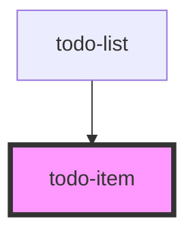

# todo-item

<!-- Auto Generated Below -->

## Properties

| Property | Attribute | Description | Type   | Default     |
| -------- | --------- | ----------- | ------ | ----------- |
| `todo`   | --        |             | `Todo` | `undefined` |

## Events

| Event              | Description | Type                |
| ------------------ | ----------- | ------------------- |
| `todoDeleted`      |             | `CustomEvent<Todo>` |
| `todoStateChanged` |             | `CustomEvent<Todo>` |
| `todoTitleChanged` |             | `CustomEvent<Todo>` |

## Dependencies

### Used by

 - [todo-list](../todo-list)

### Graph

----------------------------------------------

*Built with [StencilJS](https://stenciljs.com/)*
